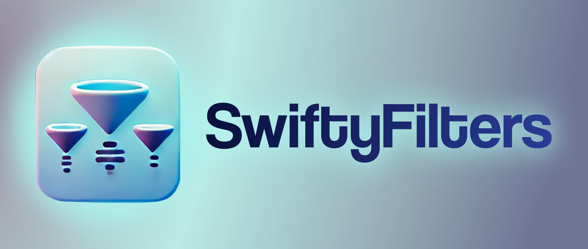

<p align="center">
  
</p> <!-- Закрываем тег <p> для изображения -->

<p align="center">
  <a href="https://swift.org/"></a>
  <a href="https://github.com/maydibee/SwiftyFilters/blob/main/LICENSE"></a>
  <a href="https://swift.org/package-manager/"></a>
  <a href="https://developer.apple.com/ios/"></a>
</p>

<h2 align="left">Build High-Performance Filter Trees Declaratively</h2>
<h4 align="left">With SwiftyFilters, create nested filters in just a few steps—effortlessly and efficiently.</h4>

---

**Never has creating complex filters in iOS apps been so effortless.**  
SwiftyFilters is a lightweight framework that lets you build nested filter trees in a **declarative style** with just a few lines of code. Built with performance in mind, SwiftyFilters uses lazy-loading at every level to ensure your app stays fast and responsive. It only loads data and allocates resources when they’re actually needed.

## 🚀 Features

- **Declarative API** – Define filters in a clear, readable way.
- **Nested Filters** – Build complex filter hierarchies effortlessly.
- **Performance First** – Lazy-loading components to optimize resource usage.

---

## 📦 Installation

### Swift Package Manager

1. In Xcode, open your project and navigate to **File → Add Packages...**.
2. Paste the repository URL: 
https://github.com/maydibee/SwiftyFilters.git
3. Select the version you want to use (or leave as "Up to Next Major").
4. Click **Add Package**.

### Manual Setup

Add SwiftyFilters as a dependency in your `Package.swift`:
```swift
dependencies: [
 .package(url: "https://github.com/[YourGitHubUsername]/SwiftyFilters.git", from: "1.0.0")
]
```

## 📝 Documentation

Documentation is coming soon! Stay tuned for detailed guides and API references.

